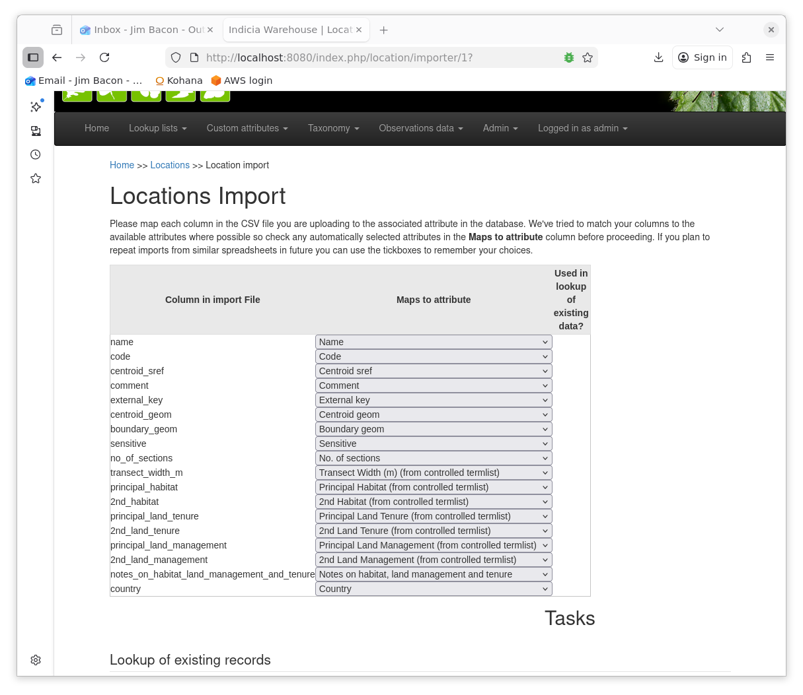
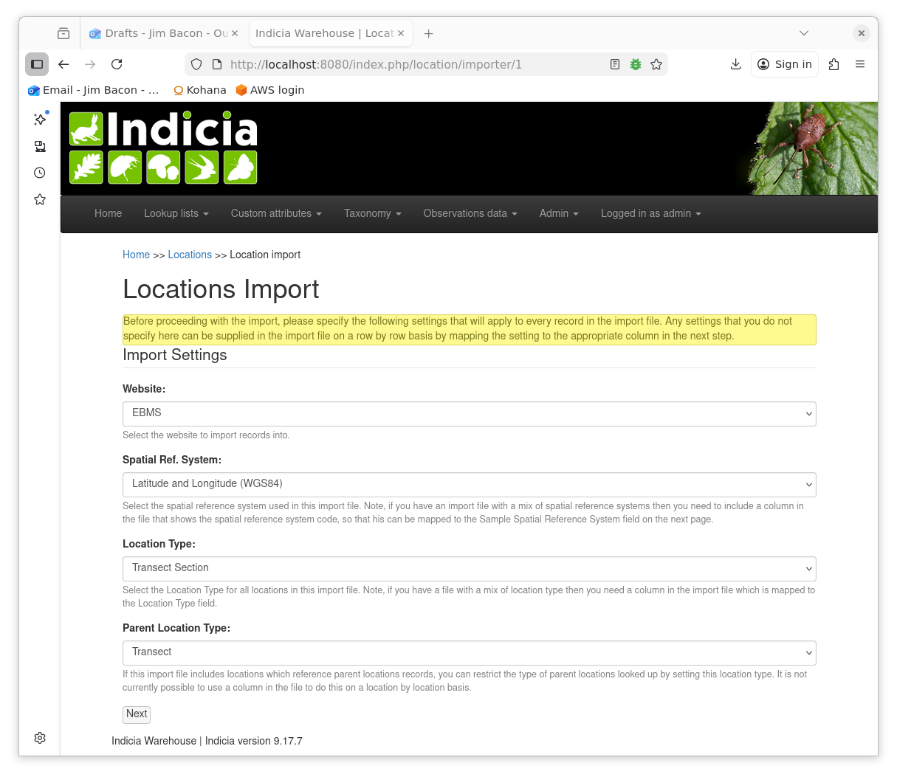
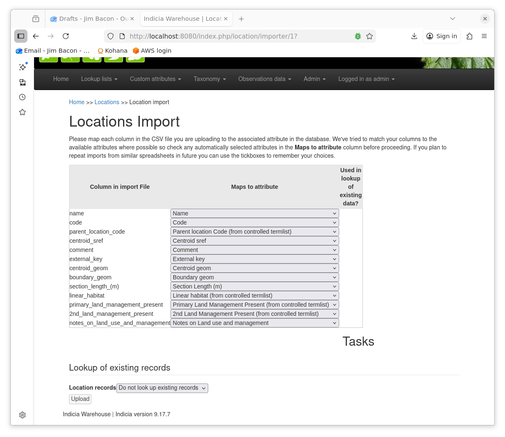
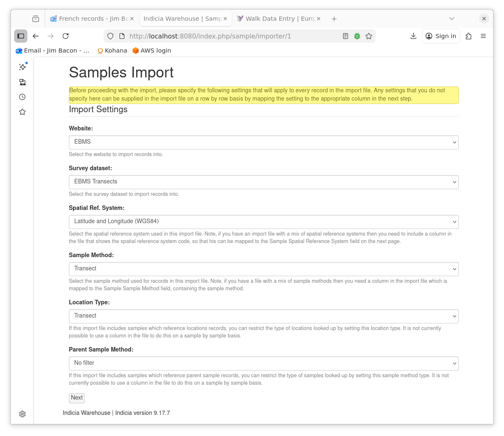
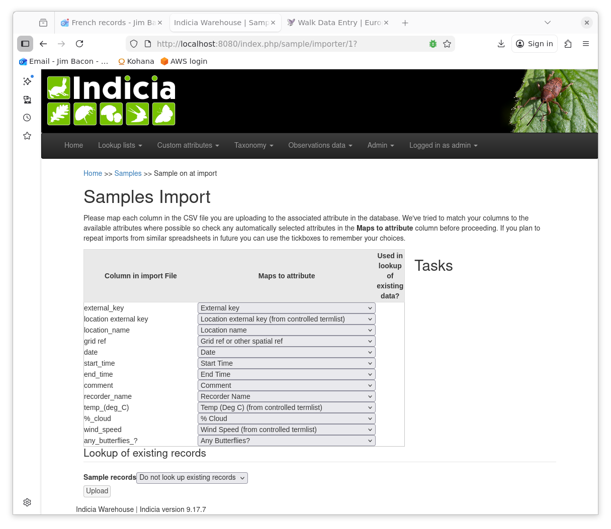
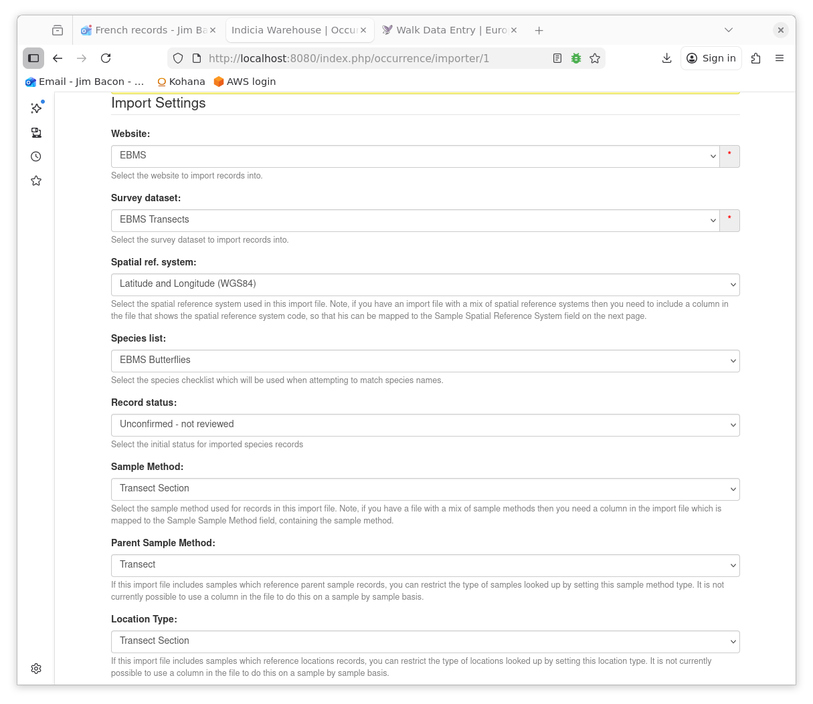
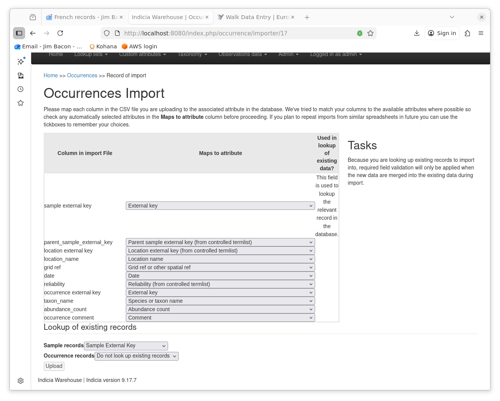

******************************
Importing Transect Survey Data
******************************

Transect surveys are commonly used for butterfly monitoring. A transect is a
walking route that is broken in to sections and the survey is performed by 
recording all the butterflies in each section, making regular revisits through
the year.

To store this in Indicia we use 

- a parent location to describe the whole transect and child locations for each
  section of the transect.
- a parent sample to describe a visit and child samples for the occurrences of
  each section.

This kind of data can be imported in four stages detailed below. This is a real
example from the European Butterfly Monitoring Scheme. It references attributes 
and term lists which have been configured for that survey. A different survey 
would have different attributes. The import is performed through the Indicia
warehouse website interface.

Import Transects
================

The transects are imported from a CSV file with the following columns. The 
headings are chosen so that they match automatically to the corresponding 
database fields.

=========================================== ===========
Column Name                                 Description
=========================================== ===========
name                                        A human-readable name for the transect.
code                                        A unique code to identify the transect (max 20 chars).
centroid_sref                               A spatial reference in a coordinate system  such as latitude and Longitude in decimal degrees (SRID 4326). E.g. 48.9N, 2.4E
comment                                     Any text comment.
external_key                                A unique identifier of the record in the source database.
boundary_geom                               The transect geometry in WKT and Web Mercator projection (SRID 3857)
sensitive                                   A boolean attribute, True/False. 
no_of_sections                              An integer attribute.
transect_width_m                            A term list attribute.
principal_habitat                           A term list attribute.
2nd_habitat                                 A term list attribute.
principal_land_tenure                       A term list attribute.
2nd_land_tenure                             A term list attribute.
principal_land_management                   A term list attribute.
2nd_land_management                         A term list attribute.
notes_on_habitat_land_management_and_tenure A text attribute.
country                                     An integer attribute.  
=========================================== ===========

The warehouse page at Lookup lists > Locations has controls for uploading the 
CSV file. After uploading, you first enter some general settings. This includes
selecting the coordinate reference system used for the centroid_sref. See 
screenshot below.

The next step is to map CSV columns to database fields. Because of the column
names that were chosen, this happens automatically. See screenshot below.

If the import has failures then there will be an explanation in a file that you
can download. This may refer to the log file which is accessible under the 
Admin > Browse server logs menu item.

A common error is for a term to be mis-typed and not be found in the termlist.

Import Transect Sections
========================

We import the sections in the same manner as the transects. The significant
difference is that we need a column in the CSV file that allows us to link the
section to its transect. Any of the location fields which can contain unique
identifiers can serve this purpose: the id, code or external_key. In this
example the code is used.

The columns in the CSV file are as follows.

=========================================== ===========
Column Name                                 Description
=========================================== ===========
name                                        A human-readable name for the section.
code                                        A unique code to identify the section (max 20 chars).
parent_location_code                        The code used to identify the parent transect.
centroid_sref                               A spatial reference in a coordinate system  such as latitude and Longitude in decimal degrees (SRID 4326). E.g. 48.9N, 2.4E
comment                                     Any text comment.
external_key                                A unique identifier of the record in the source database.
boundary_geom                               The section geometry in WKT and Web Mercator projection (SRID 3857)
section_length_(m)                          An integer attribute.
linear_habitat                              A term list attribute.
primary_land_management_present             A term list attribute.
2nd_land_management_present                 A term list attribute.
notes_on_land_use_and_management            A text attribute.
=========================================== ===========

The settings differ from previously by location type and parent location type.
See screenshot below.

Again the column mappings are automatic. See screenshot below.

You can now browse the list of locations and edit them. You should be able to 
see that sections appear as children of their transect. 

Import Visits
=============

The visit samples are imported at Observation data > Samples. They are linked
to the transect locations by a unique field and this time I have used the
external key. The columns in the CSV file were as follows.

=========================================== ===========
Column Name                                 Description
=========================================== ===========
external_key                                A unique identifier of the record in the source database.
location external key                       The unique external_key used to identify the transect location.
location_name                               The transect name. Seems redundant but keeps things pretty.
grid ref                                    A spatial reference in a coordinate system  such as latitude and Longitude in decimal degrees (SRID 4326). E.g. 48.9N, 2.4E. Seems redundant but required.
date                                        The visit date, yyyy-mm-dd.
start_time                                  A time attribute, hh:mm.
end_time                                    A time attribute, hh:mm.
comment                                     Any text comment.
recorder_name                               A text attribute.
temp_(deg_C)                                A term list attribute.
%_cloud                                     An integer attribute.
wind_speed                                  A term list attribute.
any_butterflies\_?                          A boolean attribute, 0/1.
=========================================== ===========

Note, for automatic field matching, omit underscores from 'location external 
key' and 'grid ref'.

The settings for the sample import are similar to the locations. The coordinate
reference system selected should match that of the grid_ref. See screenshot
below.

The CSV columns are mapped automatically. See screenshot below.

Import Samples and Occurrences
==============================

Finally we import the section samples with occurrences. The file is uploaded at
Observation data > Occurrences. It has to form two links, one to the visit
sample and one to the section_location. I've used the external_key fields again
for this. The columns in the CSV file were as follows.

=========================================== ===========
Column Name                                 Description
=========================================== ===========
sample external key                         A unique identifier of the sample in the source database.
parent_sample_external_key                  The unique external_key used to identify the visit sample.
location external key                       The unique external_key used to identify the section location.
location_name                               The transect name. Seems redundant but keeps things pretty.
grid ref                                    A spatial reference in a coordinate system  such as latitude and Longitude in decimal degrees (SRID 4326). E.g. 48.9N, 2.4E. Seems redundant but required.
date                                        The sample date, yyyy-mm-dd. This will be the same as the visit date in our case.
reliability                                 A term list attribute.
occurrence external key                     A unique identifier of the occurrence in the source database.
taxon_name                                  The latin species name from a pre-defined species list.
abundance_count                             An integer attribute.
occurrence comment                          Any text comment.
=========================================== ===========

Note, for automatic field matching, omit underscores from 'sample external 
key', 'location external key', 'grid ref', 'occurrence external key', and 
'occurrence comment'.

In selecting the settings, the spatial reference system should match that of the
grid_ref and the species list should be the one from which the taxon_names have
been chosen. See screenshot below.

The columns are mapped automatically but we make an additional setting which is
to look up existing sample records. A sample may have multiple occurrences and
thus multiple rows in the CSV file. The first such row will create a sample and
we want all subsequent rows to attach the occurrences to the same sample. This
can be done by using columns in the csv file to map to something unique in the 
sample. In this case I have used the sample_external_key. See screenshot below.

