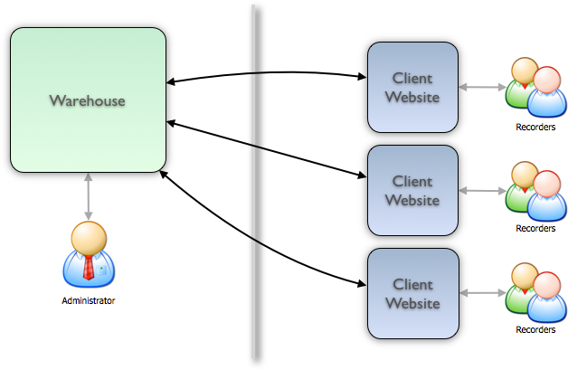

*********************
Architecture Overview
*********************

If you need a brief introduction to the technical architecture of Indicia, then 
read on. 

A website built using Indicia consists of 2 main components:

* The warehouse
* The client website

The warehouse consists of the database itself and administration tools as well 
as a set of web-services which allow the client website to communicate with it. 
The client website is the part which hosts the online recording, reporting and 
other pages which the end-user sees. Indicia uses a *distributed architecture*,
meaning that the client website and the warehouse can be on separate machines
connected only via the internet. The division into two components serves to 
keep the administration interfaces and the end-user interfaces completely 
separate. Also, a fully featured online recording solution makes heavy demands 
on the server technology, in particular to allow it to properly support spatial 
data. Therefore this separation allows a single warehouse to be shared between 
multiple client websites. As long as a partner able to host a warehouse can be 
found, the server technology required to run online recording on a client 
website is minimal. In fact, most cheap web hosting services will support 
Indicia-based online recording client websites. 

Whether developing for warehouse or client website, an understanding of the 
data model used by the warehouse and the API provided for communicating between 
the two will be important. 