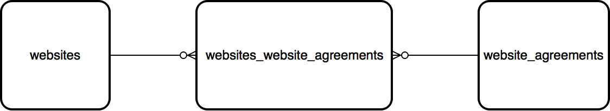

Website agreements
==================

By default, when you use the Indicia reporting system to pull out occurrence records having
authenticated your request as coming from a website registered on the warehouse, the
reporting system will automatically filter the response to only include records belonging
to that website, as long as the report is "well-behaved" of course. This might not always
be the desired behaviour, for example on iRecord the reporting system includes the records
captured via a wide variety of apps and website portals as well as those entered directly
into iRecord itself. The website agreements module in the database provides a way to
declare agreements (like contracts) which websites can join and configure how they
contribute or receive records to and from other websites who have joined the same contract.
It is possible to set different permissions for different "tasks", e.g. a website may
contribute records to the iRecord portal for verification purposes but not general
reporting.

In general you don't need to write queries against the website agreement tables directly
since the reporting system automatically builds the correct list of website_ids to filter
against and inserts this into the report query for you.

