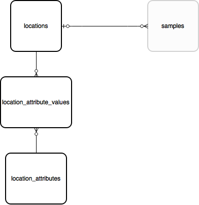

Locations and sites
===================

Indicia allows for ad-hoc entry of samples at any location as well as samples linked to
explicit locations described in the database. If a record is made at a location where
there is no benefit from defining additional data about the site, or repeat recording at
that site, it is acceptable to input a sample which stores the geometry of the sample
location in the `samples.geom` field. This geometry will typically be a point, buffered
point including inaccuracy information, or grid square, but might also be a transect line
or other geometry. No other metadata relating to the polygon itself is collected in this
instance (other than the point-in-time attribute values captured with the sample). Note
that the `samples` table can hold a simple hierarchy of surveying event information, for
example a sample could be created to hold the line of a walk, plus sub-samples for the
locations along the walk where records were taken.

Once a polygon needs to have some sort of persistent meaning in the database, for example
a site that may be revisited, or an administrative boundary, it should be stored in the
locations table. The location has traditional fields such as a name (`locations.name`)
and the spatial reference (point or grid square) of the centre
(`locations.centroid_sref`). It has separate geometry fields for the centroid and
boundary (`locations.centroid_geom` and `locations.boundary_geom`). So, in a typical
locations record, the `centroid_sref` and `centroid_geom` fields will describe the point
or grid square at the centre of the location and the `boundary_geom` provides the polygon
describing the boundary.

There are several fields involved in storing spatial data in the `samples` and
`locations` tables. In summary:

* Fields named `*_geom` in the `samples` and `locations` tables are all proper spatial
  objects (GEOMETRY data type) that use the PostGIS extensions for PostgreSQL. They can
  store points, polygons, lines and other geometries. This means you can use the rich
  suite of PostGIS functions in your queries. The default behaviour of Indicia is to
  store them in Web Mercator projection (EPSG:3857) which avoids the need to reproject
  geometries when they are drawn over the majority of widely used web mapping services.
* Fields named `*_sref` in the tables hold the spatial reference in the format it was
  originally input by the recorder. This may be an x, y coordinate, a Latitude and
  Longitude in one of several formats, or a grid reference notation if supported by
  Indicia. E.g. "54.123N 0.876E" or "SY010203".
* Fields named `*_sref_system` in the database either provide the EPSG code of the
  system for the text in the `*_sref` field, or a brief code which defines the notation
  and projection in use. For example, it will hold "4326" for WGS84 GPS latitude and
  longitude, or "OSGB" for Ordnance Survey British National Grid notation (which uses
  EPSG 27700 implicitly as the underlying projection). Where an alphabetic code is given
  for a spatial reference notation, there must be a matching module installed on the
  warehouse to handle the intepretation of this grid system's notation.

Once a location has been added to the table, it may be used in several ways:

  * As a filter for generating report outputs.
  * Linked to a sample using a foreign key in `samples.location_id`. Note that a sample may
    lie inside a boundary of a location without the sample linking directly to the location
    - this means the relationship to the location would need to be implied by a spatial
    query rather than a traditional database relationship.
  * Any layer of locations which is frequently tagged against a record (e.g. vice counties
    or other region) can be indexed using the warehouse spatial_index_builder module. This
    module then runs spatial queries to link all the samples in the database to the
    locations in the indexed layer and stores these links in the database. For example
    the cache_occurrences.location_id_vice_county field gives a direct link to a record's
    vice county in the BRC warehouse configuration.

Locations support custom attributes so can be extended to support any metadata you require.

See :doc:`Locality data <locality-data>` for more information on spatial data in the
database.

Ref. :ref:`table_locations`
