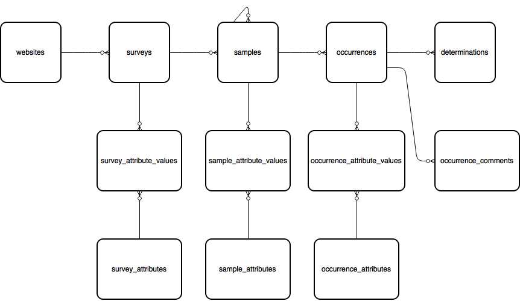

websites > surveys > samples > occurrences
==========================================

The main spine of the data model captures species observations and is covered by the
websites, surveys, samples, occurrences and determinations tables. The following diagram
shows the relationships between these tables as well as the associated custom attribute
tables described later on this page:

websites
--------

All occurrence data in the database are "owned" by the client website which they were
entered on. Each client website has an entry in the websites table which allows all the
records to be  tagged against the website ID which contributed them. By default each
website can only view or edit the occurrence data belonging to them, though it is also
possible to set up agreements between registered websites that allow the records to be
shared. For example,  this approach is used to allow multiple websites to share their
records to the iRecord verification portal in the UK. 

Ref. :ref:`table_websites`

surveys
-------

Within each website registered on the warehouse, data are divided up into survey datasets,
each described by a single row in the surveys table. Each survey dataset can have a
different set of attributes collected for the records it contains so it makes sense to
divide the records into multiple survey datasets based on their purpose and data structure
rather than to keep them all together in one. For example, a survey dataset for insect
data might collect an attribute for the count of each record, whereas one for plant
data might collect a DAFOR abundance value. The configuration of custom attributes
available is defined at the level of the survey dataset therefore it is often the case that
a survey dataset is created for each recording form you build. 

Ref. :ref:`table_surveys`

samples
-------

A sample defines a set of data which were collected by the same recorder(s) on the same
date at the same place using the same method. Therefore you would expect to have a sample
record created for each grid reference you recorded at during a day of recording. Each
sample can contain any number of occurrences (records) and each sample belongs to a
survey dataset which defines the additional custom attributes available to record against
it.

Note that samples can be hierarchical by pointing the parent_id foreign key field at
another sample record. This allows more complex surveying methodologies to be captured,
for example a transect sample can capture metadata about the overall transect, then
sub-samples can capture the records at exact points along the transect.

Samples capture the entered map reference as both a plain text field (as entered by the
recorder) and a spatial object ready for drawing on a map. We'll cover spatial data in
detail in the next section.

.. tip::

  Since a sample date can span several days, or may not be precisely known (especially
  relevant for historic data), sample dates are stored in a 3 field "vague date format"
  borrowed from Recorder. The first 2 fields are a date_start and date_end field which
  define the complete range of dates covered by the vague date. They will be the same if
  a single exact date is provided and one or the other can be null (e.g. when specifying
  a date before 2009 the start date will be null). The 3rd date_type field is a code which
  describes what type of date is being given, e.g. an exact day, month, year or date range.
  You can use the `vague_date_to_string(date_start, date_end, date_type)` function to
  convert the date stored in the database into formatted text for display.

Ref. :ref:`table_samples`

occurrences
-----------

Each occurrence of a species recorded in the database is stored as a single record in the
occurrences table. Occurrences always belong to samples, have a foreign key to the taxon
and may have additional custom attributes attached, e.g. for the abundance count.

The following example illustrates this section of the database schema by selecting some
simple details from the most recently added record in the database. Note it doesn't include
any taxonomic information - we'll cover that in a moment.

.. code-block:: sql

  select o.id,
    w.title as website_title,
    su.title as survey_title,
    s.entered_sref,
    vague_date_to_string(s.date_start, s.date_end, s.date_type) as "date"
  from websites w
  join surveys su on su.website_id=w.id and su.deleted=false
  join samples s on s.survey_id=su.id and s.deleted=false
  join occurrences o on o.sample_id=s.id and o.deleted=false
  where w.deleted=false
  order by o.id desc
  limit 1

A key aspect of the occurrences table is the ability to easily track the status of a
record especially with respect to quality. This is achieved using 2 fields, record_status
and record_substatus. The record_status field provides the broad status of the record and
the optional record_substatus field provides a greater level of granularity. The
record_status has the following possibilities:

  * V = verified or accepted
  * C = data entry complete and pending check
  * R = rejected or not accepted

When the record_status is combined with the record_substatus the possibilities are as
follows:

  * V + null = verified or accepted
  * V + 1 = verified or accepted as correct (i.e. accepted as beyond reasonable doubt, e.g.
    if specimen or good photographic evidence available).
  * V + 2 = verified or accepted as considered correct (i.e. accepted but without
    photographic or voucher specimen evidence)
  * C + 3 = data entry complete, checked but not conclusive, marked as plausible.
  * C + null = data entry complete and pending check
  * R + 4 = rejected as considered incorrect
  * R + 5 = rejected as incorrect (i.e. evidence available to prove it is incorrect beyond
    reasonable doubt).
  * R + null = rejected or not accepted

Therefore a query to obtain all accepted records can simply filter on record_status=V and
ignore the substatus.

Ref. :ref:`developing/data-model/tables:occurrences`

occurrence_comments
-------------------

The occurrence comments contains a log of all comments, including:

  * those made by recorders on each others records
  * queries made by experts
  * verification decisions made by experts
  * comments added by automatic record quality checks, e.g. flagging records outside the
    expected range or time of year.

Ref. :ref:`data-model/tables:occurrence-comments`

determinations
--------------

Where there have been multiple opinions on the identification of a record, the
determinations table contains *previous* identification details.

Ref. :ref:`tables:determinations`
