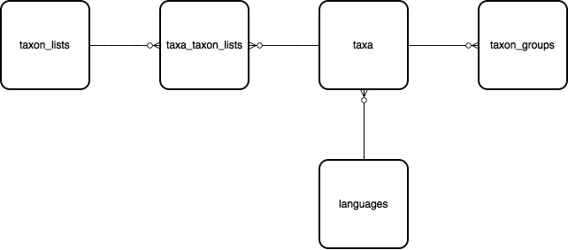

taxon_lists > taxa_taxon_lists > taxa
=====================================

The second key part of the database is the taxonomy module which captures information
about the species and other taxa which you can record against.

taxon_lists
-----------

The database stores multiple lists of taxa. A list can be anything from a simple flat list
of a few species being recorded by a citizen science project to a full hierarchical
taxonomy for a country's species list.

Ref. :ref:`table_taxon_lists`

taxa_taxon_lists
----------------

The taxa_taxon_lists table serves to join taxa to the lists they belong to.

Ref. :ref:`table_taxa_taxon_lists`

taxa
----

The taxa table contains one row per taxon name. A single species concept, therefore, may
have several rows in the taxa table, with one for the currently accepted name, plus others
for synonyms and common names.

Here's an example which grabs the taxon names in a list with common names:

.. code-block:: sql

  select t.taxon, string_agg(distinct tc.taxon, ', ') as common
  from taxa_taxon_lists ttl
  join taxa t on t.id=ttl.taxon_id
  left join (taxa_taxon_lists ttlc
    join taxa tc on tc.id=ttlc.taxon_id and tc.deleted=false
    join languages lc on lc.id=tc.language_id and lc.iso<>'lat'
  ) on ttlc.taxon_meaning_id=ttl.taxon_meaning_id
  where ttl.deleted=false
  and ttl.taxon_list_id=1
  and ttl.preferred=true
  group by t.taxon

Don't worry if that query is looking a bit complex, later we'll see how the reporting cache
tables make querying both observational and taxonomic data much simpler.

In the taxonomy module, there are several different "key" fields which can be used to
refer to database records in different ways:

  * taxa_taxon_lists.id (taxa_taxon_list_id) is the primary key of every instance of a
    unique taxon name within a taxonomic checklist or hierarchy. Every accepted latin name,
    synonym and common name has a unique identifier. Generally when linking an occurrence
    to its identification we use the taxa_taxon_list_id because it gives a precise
    reference to the exact name used and the list it was selected from - reports can easily
    work out from this the currently accepted name or common name for output for example.
  * preferred_taxa_taxon_list_id is the taxa_taxon_list_id of the currently accepted name
    on the list. It can be used to quickly identify a group of all the given names for a
    taxon on a list since they will all share the same preferred_taxa_taxon_list_id.
  * The taxa_taxon_lists.taxon_meaning_id field contains an ID that is unique for each
    species concept so can be used to easily locate and translate between the  different
    names available for a taxon. This is very similar to the preferred_taxa_taxon_list_id
    except that taxon_meaning_id can be shared across lists (when the list creator chooses
    to do so). This means that if you select all the records which have the same taxon
    meaning ID you will get all the given combinations of taxon names and species
    checklists across all lists.
  * The taxa.external_key field is often used to store an externally recognised identifier
    for the taxon. In the UK it is used to store the preferred Taxon Version Key as used
    in the UK Species Inventory (UKSI). TVKs are also used by the NBN to identify taxa.

Ref. :ref:`table_taxa`

taxon_groups
------------

The taxon_groups table provides a list of labels (sometimes called reporting categories)
which are often used in reporting to  help clarify taxon names in a user friendly way. Each
taxon belongs to a single taxon group and group names can be taxonomic but don't have to
be, for example a taxon group could  be called "aquatic insects" if desired.

Ref. :ref:`table_taxon_groups`

languages
---------

A simple lookup list of languages used in the taxonomy and termlists parts of the database,
e.g. separates Latin names from English names. Includes the 3 letter iso language code
which can be used as a shortcut to the full language name.

Ref. :ref:`table_languages`

