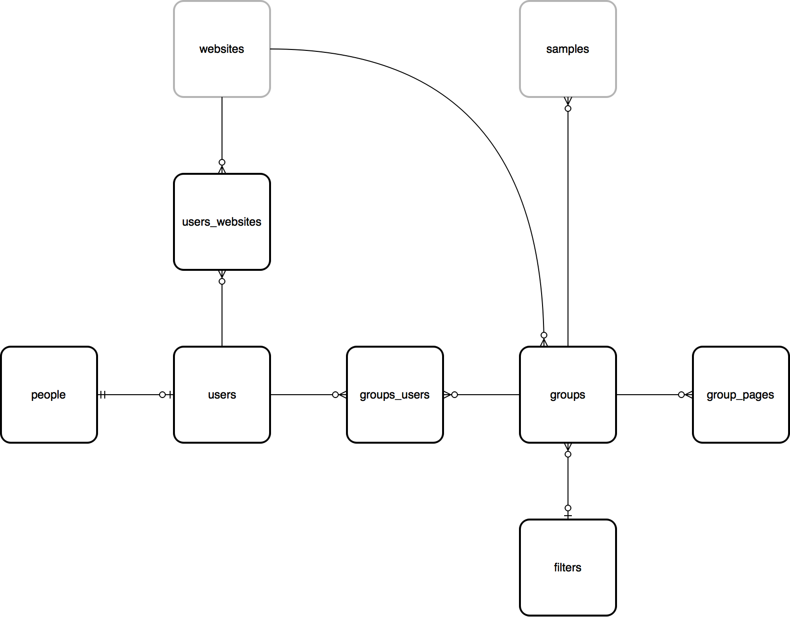

People, users and groups
========================

This module contains information about people (including those which are users of the
system in some way and those which aren't) and allows them to be grouped for any purpose,
e.g. to work together on an activity, share records and reports etc.

people
------

The people table is used to maintain a list of all known people, whether or not they are
actually users.

Ref. :ref:`developing/data-model/tables:people`

users
-----

The users table contains a record *in addition to the record in people* for all people
who actually log in to the Indicia warehouse or a client recording website or app. A
users table provides the id which gets tagged against all record metadata to imply
ownership. Therefore someone who does not log in to the system is represented by a people
record only, whereas someone who does log in is represented by a people record (containing
their name etc) and a users record (which provides login information).

.. note::

  Although the people table can be used to maintain a list of known people, where a record
  has attached metadata such as the name of the determiner we will often keep this as a
  free text value in a custom attribute rather than a record in the people table. We don't
  always know if one John Smith is the same person as another, so a free text label is more
  logically correct.

Ref. :ref:`developing/data-model/tables:users`

users_websites
--------------

This is a simple join table which links the users to the websites that they are associated
with. The information also includes a role which provides permissions information for the
warehouse, e.g. where a user has rights to log into the warehouse and update the survey
dataset definitions for that website.

Ref. :ref:`developing/data-model/tables:users_websites`

groups
------

The groups table contains a single record for any named group of users and can be used for
a variety of purposes. A group might be created for a bioblitz event, for a local natural
history society or for a national recording scheme.

.. tip::

  The groups and associated tables are used to drive the Activities functionality on
  iRecord.

A group record defines various settings for the group including privacy settings and other
metadata.

Ref. :ref:`developing/data-model/tables:groups`

groups_users
------------

The groups_users table joins users to the groups/activities they belong to and also flags
which group members can administer the group settings.

Ref. :ref:`developing/data-model/tables:groups_users`

group_pages
-----------

Each group can maintain a list of pages on client websites which are used by the group
members and include reporting and data entry pages. Pages can be configured to be available
to all users or group administrators only, plus there is an option to define multiple
access levels of group membership where more fine-grained control is required.

Ref. :ref:`developing/data-model/tables:groups_pages`

filters
-------

Although not really part of the users, people and groups database module, the filters table
is used to contain the definition of parameters which are passed to reports displayed for a
group. For example, when displaying a list of occurrences, the filters record associated
with a group might define the polygon boundary of the site used by the group or perhaps
the taxonomic filter appropriate to the group.

Ref. :ref:`developing/data-model/tables:filters`

